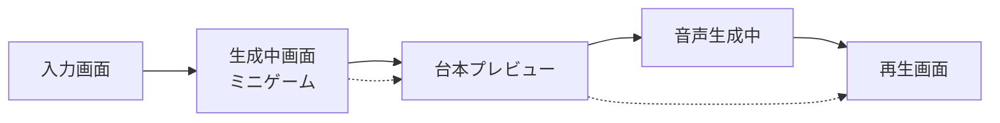

# CheerCast Cloud Run 要件定義書

## 概要

CheerCastをGoogle Cloud Run上でWebアプリケーションとして動作させるための要件を定義します。現在のCLIベースの機能をWebブラウザから利用可能にすることで、より多くのユーザーが簡単にアクセスできるようになります。

## システム構成

### アーキテクチャ概要

```
┌─────────────────┐     ┌─────────────────┐     ┌─────────────────┐
│                 │     │                 │     │                 │
│  Web Browser    │────▶│  Cloud Run      │────▶│  Gemini API     │
│                 │     │  (CheerCast)    │     │                 │
└─────────────────┘     └────────┬────────┘     └─────────────────┘
                                 │
                                 ▼
                        ┌─────────────────┐
                        │                 │
                        │  Cloud Storage  │
                        │                 │
                        └─────────────────┘
```

### 主要コンポーネント

1. **Web フロントエンド**
   - React/Vue.js/Next.js によるSPA
   - メモ入力フォーム
   - 生成進捗表示
   - 音声プレイヤー

2. **バックエンドAPI (Cloud Run)**
   - REST API エンドポイント
   - 非同期処理対応
   - ファイルアップロード/ダウンロード

3. **ストレージ (Cloud Storage)**
   - 一時ファイル保存
   - 生成済みMP3ファイル保存
   - 有効期限付きURL生成

## 機能要件

### 1. ユーザー認証（Phase 1: オプション）

- **匿名利用**: 初期バージョンでは認証なしで利用可能
- **将来拡張**: Google認証、使用制限管理

### 2. メモ入力

#### 入力方法
- **テキストエリア**: 直接入力
- **ファイルアップロード**: txt, md, json, csv対応
- **テンプレート**: 入力例の提供

#### 入力バリデーション
- 最大文字数: 10,000文字
- ファイルサイズ: 最大1MB
- 文字エンコーディング: UTF-8

### 3. 生成オプション

```typescript
interface GenerationOptions {
  // プログラムタイプ
  programType: 'daily' | 'weekly';
  
  // 褒めスタイル
  praiseStyle: 'gentle' | 'energetic';
  
  // 番組の長さ（分）
  duration: number; // 1-10
  
  // 音声速度
  speed?: number; // 0.5-2.0
  
  // カスタムラジオ番組名
  radioShowName?: string;
}
```

### 4. 音声生成プロセス

#### 非同期処理フロー
1. **ジョブ作成**: 生成リクエスト受付、ジョブID発行
2. **台本生成完了通知**: 台本が完成したら即座に表示可能に
3. **進捗通知**: WebSocket or Server-Sent Events
4. **音声生成完了**: 完了通知とダウンロードURL

#### 進捗段階
```typescript
enum GenerationStatus {
  QUEUED = 'queued',
  PARSING = 'parsing',
  GENERATING_SCRIPT = 'generating_script',
  SCRIPT_READY = 'script_ready',  // 台本閲覧可能
  SYNTHESIZING_VOICE = 'synthesizing_voice',
  MIXING_AUDIO = 'mixing_audio',
  COMPLETED = 'completed',
  FAILED = 'failed'
}
```

### 5. 結果表示・ダウンロード

#### 台本プレビュー（音声生成前）
- **即座に表示**: 台本生成完了後すぐに閲覧可能
- **対話形式表示**: キャラクターアイコン付きチャット風UI
- **共有機能**: 台本のみの共有URL

#### 音声再生画面
- **同期再生**: 音声と台本が同期してスクロール
- **ハイライト表示**: 現在再生中の対話をハイライト
- **インタラクティブ**: 台本クリックで該当箇所から再生
- **タイムスタンプ**: 各対話の開始時刻表示

```typescript
interface PlaybackView {
  audioUrl: string;
  script: {
    dialogues: Array<{
      speaker: string;
      text: string;
      startTime: number;  // 秒
      endTime: number;    // 秒
    }>;
  };
  currentTime: number;
  isPlaying: boolean;
}
```

### 6. 待ち時間エンターテイメント

#### ミニゲーム仕様
生成待ち時間（通常30-60秒）を楽しく過ごすための簡単なゲーム。

**ゲーム案：「褒めワードキャッチャー」**
```typescript
interface MiniGame {
  type: 'word-catcher';
  config: {
    words: string[];  // 褒め言葉リスト
    speed: number;    // 落下速度
    duration: number; // ゲーム時間
  };
  score: number;
  highScore: number;
}
```

**ゲーム内容**:
- 画面上から褒め言葉が降ってくる
- 「すごい！」「えらい！」「がんばった！」などをクリック/タップ
- 集めた褒め言葉の数がスコアに
- 生成完了時に「あなたも〇〇個の褒め言葉ゲット！」と表示

**その他のゲーム候補**:
- **励ましルーレット**: スロットマシン風の応援メッセージ
- **元気メーター**: 連打で元気ゲージを貯める
- **褒めパズル**: 簡単な3マッチパズル

## API仕様

### エンドポイント設計

#### 1. 生成開始
```http
POST /api/generate
Content-Type: application/json

{
  "memo": "今日はTypeScriptの勉強を2時間した...",
  "options": {
    "programType": "daily",
    "praiseStyle": "gentle",
    "duration": 5
  }
}

Response:
{
  "jobId": "550e8400-e29b-41d4-a716-446655440000",
  "status": "queued",
  "estimatedTime": 60
}
```

#### 2. ファイルアップロード生成
```http
POST /api/generate/upload
Content-Type: multipart/form-data

memo: (file)
options: {"programType": "daily", ...}

Response:
{
  "jobId": "...",
  "status": "queued"
}
```

#### 3. 進捗確認
```http
GET /api/jobs/{jobId}

Response:
{
  "jobId": "...",
  "status": "synthesizing_voice",
  "progress": 60,
  "message": "音声を生成中...",
  "scriptAvailable": true,  // 台本が閲覧可能
  "estimatedTimeRemaining": 30
}
```

#### 4. 台本取得（音声生成前）
```http
GET /api/jobs/{jobId}/script

Response:
{
  "jobId": "...",
  "status": "script_ready",
  "script": {
    "title": "2025年1月20日のCheerCast",
    "dialogues": [
      {
        "id": "d1",
        "speaker": "あかり",
        "text": "みなさんこんにちは〜！",
        "emotion": "cheerful"
      },
      {
        "id": "d2", 
        "speaker": "けんた",
        "text": "今日もお疲れ様でした！",
        "emotion": "gentle"
      }
    ]
  }
}
```

#### 5. 最終結果取得（音声付き）
```http
GET /api/jobs/{jobId}/result

Response:
{
  "jobId": "...",
  "status": "completed",
  "audioUrl": "https://storage.googleapis.com/...",
  "script": {
    "title": "2025年1月20日のCheerCast",
    "dialogues": [
      {
        "id": "d1",
        "speaker": "あかり",
        "text": "みなさんこんにちは〜！",
        "startTime": 0.0,
        "endTime": 2.5,
        "emotion": "cheerful"
      },
      {
        "id": "d2",
        "speaker": "けんた", 
        "text": "今日もお疲れ様でした！",
        "startTime": 2.5,
        "endTime": 4.8,
        "emotion": "gentle"
      }
    ]
  },
  "duration": 300,  // 総再生時間（秒）
  "expiresAt": "2025-01-21T12:00:00Z"
}
```

#### 6. ミニゲーム状態管理
```http
POST /api/games/score

Request:
{
  "jobId": "...",
  "gameType": "word-catcher",
  "score": 42
}

Response:
{
  "newHighScore": true,
  "globalRank": 123,
  "encouragementMessage": "42個も褒め言葉をゲット！すごい！"
}
```

## 非機能要件

### 1. パフォーマンス

- **レスポンスタイム**: API応答 < 500ms
- **生成時間**: 5分番組 < 60秒
- **同時処理**: 10リクエスト/インスタンス

### 2. スケーラビリティ

- **Cloud Run設定**:
  - 最小インスタンス: 0（コールドスタート許容）
  - 最大インスタンス: 100
  - CPU: 2
  - メモリ: 4GB
  - タイムアウト: 300秒

### 3. セキュリティ

- **API制限**: 
  - レート制限: 10リクエスト/分/IP
  - 日次制限: 100リクエスト/IP
- **入力検証**: SQLインジェクション、XSS対策
- **ファイルスキャン**: アップロードファイルのウイルススキャン
- **CORS設定**: 許可されたオリジンのみ

### 4. 可用性

- **SLA目標**: 99.5%
- **エラーハンドリング**: 
  - Gemini API障害時の再試行
  - 一時的な障害の自動リカバリ
- **ヘルスチェック**: /health エンドポイント

### 5. 監視・ログ

- **Cloud Logging**: 全リクエスト・エラーログ
- **Cloud Monitoring**: 
  - API レスポンスタイム
  - エラー率
  - 生成成功率
- **Error Reporting**: 例外の自動収集

## 実装フェーズ

### Phase 1: MVP (2-3週間)

1. **基本Web UI**
   - シンプルな入力フォーム
   - 生成ボタン
   - 結果表示

2. **同期API**
   - 単純な生成エンドポイント
   - タイムアウト対応

3. **Cloud Run デプロイ**
   - Dockerfile作成
   - 基本的なCI/CD

### Phase 2: 非同期処理 (2週間)

1. **ジョブ管理**
   - Cloud Tasks統合
   - 進捗通知

2. **ストレージ統合**
   - Cloud Storage連携
   - 一時ファイル管理

### Phase 3: UX改善 (2週間)

1. **リッチUI**
   - プログレスバー
   - 台本プレビュー（音声生成前）
   - 同期再生ビュー

2. **共有機能**
   - 短縮URL
   - SNS共有
   - 台本のみ共有

3. **ミニゲーム実装**
   - 褒めワードキャッチャー
   - スコアランキング
   - 待ち時間表示

### Phase 4: スケール対応 (1週間)

1. **パフォーマンス最適化**
   - キャッシュ実装
   - CDN統合

2. **監視強化**
   - ダッシュボード作成
   - アラート設定

## コスト見積もり

### 月間想定利用量（1000ユーザー、各10回利用）

| サービス | 使用量 | 単価 | 月額費用 |
|---------|-------|------|---------|
| Cloud Run | 10,000リクエスト × 60秒 | $0.00004/vCPU秒 | $24 |
| Cloud Storage | 100GB（音声ファイル） | $0.020/GB | $2 |
| Gemini API | 10,000回 × 2000文字 | $0.00025/1000文字 | $5 |
| ネットワーク | 50GB（ダウンロード） | $0.12/GB | $6 |
| **合計** | | | **約$37** |

## UI/UXデザイン仕様

### 1. 画面遷移フロー



### 2. 各画面の詳細

#### 入力画面
- **メインエリア**: 大きなテキストエリア
- **サンプル表示**: 入力例をグレーアウトで表示
- **オプション**: アコーディオンで折りたたみ
- **生成ボタン**: 大きく目立つデザイン

#### 生成中画面（ミニゲーム）
- **上部**: 進捗バーと状態メッセージ
- **中央**: ミニゲーム画面
- **下部**: 「台本ができたら見る」ボタン（台本完成後に有効化）

#### 台本プレビュー画面
- **チャット風UI**: LINEのような対話表示
- **キャラアイコン**: あかり👩、けんた👨
- **吹き出し**: 左右交互に表示
- **下部**: 「音声ができるまで待つ」「入力に戻る」ボタン

#### 再生画面
- **上部**: オーディオプレイヤー
- **中央**: 台本表示エリア（自動スクロール）
- **ハイライト**: 現在再生中の対話を強調
- **コントロール**: 
  - 再生/一時停止
  - 10秒戻る/進む
  - 再生速度（0.75x, 1x, 1.25x, 1.5x）

### 3. レスポンシブデザイン

#### モバイル（〜768px）
- 縦長レイアウト
- ミニゲームは全画面表示
- 台本は1カラム表示

#### タブレット（768px〜1024px）
- 2カラムレイアウト可能
- 台本と音声コントロールを並列表示

#### デスクトップ（1024px〜）
- 3カラムレイアウト
- 入力・台本・結果を同時表示可能

### 4. アニメーション仕様

#### 遷移アニメーション
- **ページ遷移**: スライドイン/アウト
- **要素出現**: フェードイン + 軽いバウンス
- **進捗更新**: スムーズなプログレスバー

#### ミニゲームアニメーション
- **褒め言葉**: 上から降ってくる（パララックス効果）
- **キャッチ時**: 星のエフェクト + スコアポップアップ
- **ゲーム終了**: 紙吹雪エフェクト

#### 再生画面アニメーション
- **対話切り替え**: スムーズスクロール
- **ハイライト**: グロー効果
- **一時停止/再生**: アイコンモーフィング

### 5. カラーパレット

```css
:root {
  /* メインカラー */
  --primary-red: #ff6b6b;
  --primary-yellow: #feca57;
  --primary-blue: #48dbfb;
  
  /* キャラクターカラー */
  --akari-color: #ff9ff3;
  --kenta-color: #54a0ff;
  
  /* UI カラー */
  --bg-main: #fff5f5;
  --bg-white: #ffffff;
  --text-primary: #2d3748;
  --text-secondary: #718096;
  
  /* ステータスカラー */
  --success: #48bb78;
  --warning: #ed8936;
  --error: #f56565;
}
```

## 技術的な考慮事項

### 1. コンテナ化

```dockerfile
FROM node:20-alpine

# FFmpegインストール
RUN apk add --no-cache ffmpeg

# アプリケーションコード
WORKDIR /app
COPY package*.json ./
RUN npm ci --only=production
COPY . .
RUN npm run build

EXPOSE 8080
CMD ["npm", "run", "start:web"]
```

### 2. 環境変数

```yaml
env_variables:
  GEMINI_API_KEY: ${GEMINI_API_KEY}
  GCS_BUCKET: cheercast-audio-files
  NODE_ENV: production
  PORT: 8080
```

### 3. 既存コードの変更点

1. **ファイルI/O**
   - ローカルファイル読み書き → Cloud Storage API
   - 一時ファイル → メモリバッファ or Cloud Storage

2. **設定管理**
   - cheercast.config.json → 環境変数
   - デフォルト設定のハードコード

3. **エラーハンドリング**
   - process.exit() → HTTPエラーレスポンス
   - コンソールログ → 構造化ログ

4. **非同期処理**
   - 同期的な生成 → Promise/async-await
   - 長時間処理 → ジョブキュー

5. **台本タイミング情報**
   - 各対話の開始/終了時刻を計算
   - 音声ファイルのメタデータ抽出
   - タイムスタンプとの同期

### 4. フロントエンド実装考慮点

#### 台本同期再生の実装
```typescript
// 音声再生と台本同期のサンプルコード
class SyncedPlayback {
  private audio: HTMLAudioElement;
  private dialogues: DialogueWithTiming[];
  
  constructor(audioUrl: string, dialogues: DialogueWithTiming[]) {
    this.audio = new Audio(audioUrl);
    this.dialogues = dialogues;
    
    // タイムアップデートイベントで現在の対話をハイライト
    this.audio.addEventListener('timeupdate', () => {
      const currentTime = this.audio.currentTime;
      const currentDialogue = this.findCurrentDialogue(currentTime);
      this.highlightDialogue(currentDialogue);
    });
  }
  
  private findCurrentDialogue(time: number): DialogueWithTiming | null {
    return this.dialogues.find(d => 
      time >= d.startTime && time < d.endTime
    ) || null;
  }
}
```

#### ミニゲームの実装
```typescript
// 褒めワードキャッチャーのサンプル
class WordCatcherGame {
  private words = [
    'すごい！', 'えらい！', 'がんばった！', 
    'ステキ！', 'さすが！', 'ナイス！'
  ];
  private score = 0;
  private gameLoop: number;
  
  start() {
    this.gameLoop = requestAnimationFrame(() => this.update());
  }
  
  private spawnWord() {
    const word = this.words[Math.floor(Math.random() * this.words.length)];
    const x = Math.random() * (window.innerWidth - 100);
    return new FallingWord(word, x, -50);
  }
}
```

## セキュリティ要件

### 1. API保護

- **認証**: 初期はAPIキー、将来的にOAuth2
- **入力検証**: 全パラメータのバリデーション
- **出力制御**: 生成コンテンツのフィルタリング

### 2. データ保護

- **暗号化**: HTTPS必須、保存時暗号化
- **アクセス制御**: 最小権限の原則
- **データ保持**: 24時間後に自動削除

### 3. 監査

- **アクセスログ**: 全APIコールの記録
- **変更履歴**: 設定変更の追跡
- **コンプライアンス**: GDPR対応の削除機能

## まとめ

CheerCastのCloud Run化により、以下のメリットが期待できます：

1. **アクセシビリティ向上**: CLIの知識不要
2. **スケーラビリティ**: 自動スケーリング
3. **メンテナンス性**: 一元管理
4. **拡張性**: 新機能の追加が容易

### 特徴的なUX機能

1. **段階的な結果表示**
   - 台本が完成したら即座に閲覧可能
   - 音声生成を待たずに内容を確認できる

2. **インタラクティブな再生体験**
   - 音声と台本が同期してスクロール
   - 現在の発言がハイライト表示
   - クリックで任意の位置から再生

3. **待ち時間のエンターテイメント**
   - ミニゲームで楽しく待機
   - 褒め言葉を集めてモチベーションアップ
   - スコアランキングでゲーミフィケーション

これらの機能により、単なる音声生成ツールから、楽しく使える励ましサービスへと進化します。初期実装はシンプルに始め、段階的に機能を追加していくアプローチを推奨します。