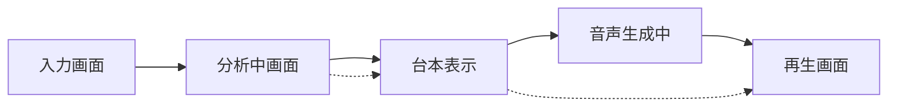

# PersonalCast Cloud Run 要件定義書

## 概要

PersonalCastをGoogle Cloud Run上でWebアプリケーションとして動作させるための要件を定義します。現在のCLIベースの機能をWebブラウザから利用可能にすることで、より多くのユーザーが簡単にアクセスできるようになります。

## システム構成

### アーキテクチャ概要

```
┌─────────────────┐     ┌─────────────────┐     ┌─────────────────┐
│                 │     │                 │     │                 │
│  Web Browser    │────▶│  Cloud Run      │────▶│  Gemini API     │
│                 │     │  (PersonalCast) │     │                 │
└─────────────────┘     └────────┬────────┘     └─────────────────┘
                                 │
                                 ▼
                        ┌─────────────────┐
                        │                 │
                        │  Cloud Storage  │
                        │                 │
                        └─────────────────┘
```

### 主要コンポーネント

1. **Web フロントエンド**
   - Next.js によるレンダリング
   - 活動記録入力フォーム
   - 分析進捗表示
   - レポートプレイヤー

2. **バックエンドAPI**
   - REST API エンドポイント（Next.js）
   - 非同期処理対応
   - ファイルアップロード/ダウンロード
   - **ローカル開発**: Node.jsサーバー
   - **本番環境**: Cloud Run

3. **ストレージ**
   - **ローカル開発**: ローカルファイルシステム
     - ./temp/ ディレクトリに一時ファイル
     - ./output/ ディレクトリに生成ファイル
   - **本番環境**: Cloud Storage
     - 一時ファイル保存
     - 生成済みMP3ファイル保存
     - 有効期限付きURL生成

## 機能要件

### 1. ユーザー認証（Phase 1: オプション）

- **匿名利用**: 初期バージョンでは認証なしで利用可能
- **将来拡張**: Google認証、使用制限管理

### 2. 活動記録入力

#### 入力方法
- **テキストエリア**: 構造化された形式で入力
- **ファイルアップロード**: txt, md, json, csv対応
- **テンプレート**: 入力例の提供

#### 入力バリデーション
- 最大文字数: 10,000文字
- ファイルサイズ: 最大1MB
- 文字エンコーディング: UTF-8

### 3. 生成オプション

```typescript
interface GenerationOptions {
  // 分析スタイル
  analysisStyle: 'analytical' | 'comprehensive';
  
  // 番組の長さ（分）
  duration: number; // 1-10
  
  // 音声速度
  speed?: number; // 0.5-2.0
  
  // カスタムニュース番組名
  newsShowName?: string;
}
```

### 4. 分析レポート生成プロセス

#### 非同期処理フロー
1. **ジョブ作成**: 分析リクエスト受付、ジョブID発行
2. **統計分析完了通知**: データ分析が完成したら即座に表示可能に
3. **進捗通知**: WebSocket or Server-Sent Events
4. **音声生成完了**: 完了通知とダウンロードURL

#### 進捗段階
```typescript
enum GenerationStatus {
  QUEUED = 'queued',
  PARSING = 'parsing',
  ANALYZING_MEMO = 'analyzing_memo',
  GENERATING_SCRIPT = 'generating_script',
  SCRIPT_READY = 'script_ready',  // 台本閲覧可能
  SYNTHESIZING_VOICE = 'synthesizing_voice',
  MIXING_AUDIO = 'mixing_audio',
  COMPLETED = 'completed',
  FAILED = 'failed'
}
```

### 5. 結果表示・ダウンロード

#### 台本表示（音声生成前）
- **即座に表示**: 台本生成完了後すぐに閲覧可能
- **テキスト表示**: 生成された台本をそのまま表示

#### 音声再生画面
- **基本的なプレイヤー**: 標準的な音声再生機能
- **台本表示**: 静的なテキストとして台本を表示

```typescript
interface PlaybackView {
  audioUrl: string;
  script: {
    sections: Array<{
      speaker: string;
      text: string;
    }>;
  };
}
```

### 6. 台本表示

#### 生成された台本
台本生成完了後、音声生成を待たずに台本をテキストで表示。

**表示内容**:
- **スピーカー名**: 発言者の名前を明示
- **発言内容**: 生成された台本をそのまま表示

```typescript
interface ScriptData {
  sections: Array<{
    speaker: string;
    text: string;
  }>;
}
```

## API仕様

### エンドポイント設計

#### 1. 分析開始
```http
POST /api/analyze
Content-Type: application/json

{
  "activityLog": "【業務活動】\n- TypeScript移行タスク2件完了...",
  "options": {
    "analysisStyle": "analytical",
    "duration": 5
  }
}

Response:
{
  "jobId": "550e8400-e29b-41d4-a716-446655440000",
  "status": "queued",
  "estimatedTime": 60
}
```

#### 2. ファイルアップロード分析
```http
POST /api/analyze/upload
Content-Type: multipart/form-data

activityLog: (file)
options: {"analysisStyle": "analytical", ...}

Response:
{
  "jobId": "...",
  "status": "queued"
}
```

#### 3. 進捗確認
```http
GET /api/jobs/{jobId}

Response:
{
  "jobId": "...",
  "status": "synthesizing_voice",
  "progress": 60,
  "message": "音声を生成中...",
  "scriptAvailable": true,  // 台本が閲覧可能
  "estimatedTimeRemaining": 30
}
```

#### 4. 台本取得（音声生成前）
```http
GET /api/jobs/{jobId}/script

Response:
{
  "jobId": "...",
  "status": "script_ready",
  "script": {
    "title": "2025年1月22日のToday's You",
    "sections": [
      {
        "speaker": "あかり",
        "text": "こんにちは。Today's Youの時間です。今日も頑張ったあなたの活動をチェックしていきましょう。"
      },
      {
        "speaker": "けんた",
        "text": "本日は総計12件の活動が記録されました。TypeScriptのタスクに特に力を入れていたことが伝わってきますね。"
      },
      {
        "speaker": "あかり",
        "text": "そうですね！プロジェクトを完了させたこともとても素晴らしいです。明日も頑張ってくださいね。"
      }
    ]
  }
}
```

#### 5. 最終結果取得（音声付き）
```http
GET /api/jobs/{jobId}/result

Response:
{
  "jobId": "...",
  "status": "completed",
  "audioUrl": "https://storage.googleapis.com/...",
  "script": {
    "title": "2025年1月22日のToday's You",
    "sections": [
      {
        "speaker": "あかり",
        "text": "こんにちは。Today's Youの時間です。今日も頑張ったあなたの活動をチェックしていきましょう。"
      },
      {
        "speaker": "けんた",
        "text": "本日は総計12件の活動が記録されました。TypeScriptのタスクに特に力を入れていたことが伝わってきますね。"
      },
      {
        "speaker": "あかり",
        "text": "そうですね！プロジェクトを完了させたこともとても素晴らしいです。明日も頑張ってくださいね。"
      }
    ]
  },
  "duration": 300,
  "expiresAt": "2025-01-23T12:00:00Z"
}
```

## 非機能要件

### 1. パフォーマンス

- **レスポンスタイム**: API応答 < 500ms
- **分析時間**: 5分番組 < 60秒
- **同時処理**: 10リクエスト/インスタンス

### 2. スケーラビリティ

- **Cloud Run設定**:
  - 最小インスタンス: 0（コールドスタート許容）
  - 最大インスタンス: 100
  - CPU: 2
  - メモリ: 4GB
  - タイムアウト: 300秒

### 3. セキュリティ

- **API制限**: 
  - レート制限: 10リクエスト/分/IP
  - 日次制限: 100リクエスト/IP
- **入力検証**: SQLインジェクション、XSS対策
- **ファイルスキャン**: アップロードファイルのウイルススキャン
- **CORS設定**: 許可されたオリジンのみ

### 4. 可用性

- **SLA目標**: 99.5%
- **エラーハンドリング**: 
  - Gemini API障害時の再試行
  - 一時的な障害の自動リカバリ
- **ヘルスチェック**: /health エンドポイント

### 5. 監視・ログ

- **Cloud Logging**: 全リクエスト・エラーログ
- **Cloud Monitoring**: 
  - API レスポンスタイム
  - エラー率
  - 分析成功率
- **Error Reporting**: 例外の自動収集

## 実装フェーズ

### Phase 1: ローカル環境での完全動作 (2-3週間)

1. **基本Web UI**
   - シンプルな入力フォーム
   - 生成ボタン
   - 結果表示

2. **ローカルAPI**
   - Next.jsでのAPIサーバー
   - ローカルファイルシステムでの一時ファイル管理
   - 同期的な分析処理

3. **ローカル開発環境**
   - 開発サーバー (npm run dev)
   - ホットリロード対応
   - ローカルストレージでのデータ保存

### Phase 2: 非同期処理対応 (1週間)

1. **ローカルジョブキュー**
   - Bull.jsなどでのローカルキュー実装
   - 進捗通知（WebSocket/SSE）
   - ローカルでの非同期処理

2. **ローカルストレージ**
   - ファイルシステムベースの一時ファイル管理
   - 生成済みファイルの管理

### Phase 3: UX改善 (1週間)

1. **リッチUI**
   - プログレスバー
   - 台本表示の改善

2. **台本表示の実装**
   - 生成された台本をそのまま表示
   - スピーカー別の発言内容

3. **共有機能**
   - 短縮URL
   - SNS共有
   - 台本のみ共有

### Phase 4: Cloud Run移行 (2週間)

1. **クラウド対応**
   - Dockerfile作成
   - Cloud Storage統合（ローカルファイルシステムからの移行）
   - Cloud Tasks統合（ローカルキューからの移行）

2. **環境切り替え**
   - 環境変数によるローカル/クラウドの切り替え
   - ローカル開発時はファイルシステム使用
   - 本番環境ではCloud Storage使用

3. **CI/CD**
   - GitHub Actions設定
   - 自動デプロイ

### Phase 5: スケール対応 (1週間)

1. **パフォーマンス最適化**
   - キャッシュ実装
   - CDN統合

2. **監視強化**
   - ダッシュボード作成
   - アラート設定

## コスト見積もり

### 月間想定利用量（1000ユーザー、各10回利用）

| サービス | 使用量 | 単価 | 月額費用 |
|---------|-------|------|---------|
| Cloud Run | 10,000リクエスト × 60秒 | $0.00004/vCPU秒 | $24 |
| Cloud Storage | 100GB（音声ファイル） | $0.020/GB | $2 |
| Gemini API | 10,000回 × 2000文字 | $0.00025/1000文字 | $5 |
| ネットワーク | 50GB（ダウンロード） | $0.12/GB | $6 |
| **合計** | | | **約$37** |

## UI/UXデザイン仕様

### 1. 画面遷移フロー



### 2. 各画面の詳細

#### 入力画面
- **メインエリア**: 構造化されたテキストエリア
- **テンプレート表示**: 活動記録の形式例
- **オプション**: アコーディオンで折りたたみ
- **分析ボタン**: プロフェッショナルなデザイン

#### 分析中画面
- **上部**: 進捗バーと状態メッセージ
- **中央**: 分析ステータス表示
- **下部**: 「台本を見る」ボタン（台本生成完成後に有効化）

#### 台本表示画面
- **台本テキスト**: 生成された台本をスピーカー名とともに表示
- **下部**: 「音声を聴く」「入力に戻る」ボタン

#### 再生画面
- **上部**: オーディオプレイヤー
- **中央**: レポート表示エリア（静的テキスト）
- **コントロール**: 
  - 再生/一時停止
  - 再生速度（0.75x, 1x, 1.25x, 1.5x）

### 3. レスポンシブデザイン

#### モバイル（〜768px）
- 縦長レイアウト
- 統計は縦スクロール
- レポートは1カラム表示

#### タブレット（768px〜1024px）
- 2カラムレイアウト可能
- 統計とレポートを並列表示

#### デスクトップ（1024px〜）
- 3カラムレイアウト
- 入力・統計・レポートを同時表示可能

### 4. アニメーション仕様

#### 遷移アニメーション
- **ページ遷移**: スライドイン/アウト
- **要素出現**: フェードイン
- **進捗更新**: スムーズなプログレスバー

#### 基本アニメーション
- **数値表示**: シンプルな表示
- **一時停止/再生**: 基本的なアイコン変更

### 5. カラーパレット

```css
:root {
  /* メインカラー（プロフェッショナル） */
  --primary-blue: #1a365d;
  --primary-light-blue: #2b6cb0;
  --accent-blue: #90cdf4;
  
  /* キャスターカラー */
  --akari-color: #4299e1;
  --kenta-color: #2d3748;
  
  /* UI カラー */
  --bg-main: #f7fafc;
  --bg-white: #ffffff;
  --text-primary: #1a202c;
  --text-secondary: #4a5568;
  
  /* 台本表示 */
  --script-speaker: #3182ce;
  --script-text: #2d3748;
  
  /* ステータスカラー */
  --success: #48bb78;
  --warning: #ed8936;
  --error: #f56565;
}
```

## 開発アプローチ

### ローカルファースト開発

開発は以下の原則に従って進めます：

1. **すべての機能をまずローカルで完全動作させる**
   - ローカルファイルシステムでのファイル管理
   - ローカルサーバーでのAPI実装
   - 外部サービス（Cloud Storage、Cloud Tasks）への依存なし

2. **環境変数による動作切り替え**
   ```typescript
   // 環境設定の例
   const config = {
     storage: process.env.USE_CLOUD_STORAGE === 'true' 
       ? 'cloud' : 'local',
     queue: process.env.USE_CLOUD_TASKS === 'true'
       ? 'cloud' : 'local',
     port: process.env.PORT || 3000
   };
   ```

3. **インターフェースの統一**
   ```typescript
   // ストレージインターフェース
   interface StorageAdapter {
     save(path: string, data: Buffer): Promise<string>;
     load(path: string): Promise<Buffer>;
     delete(path: string): Promise<void>;
   }
   
   // ローカル実装とクラウド実装を切り替え可能
   class LocalStorageAdapter implements StorageAdapter { /* ... */ }
   class CloudStorageAdapter implements StorageAdapter { /* ... */ }
   ```

4. **段階的なクラウド移行**
   - Phase 1: 完全にローカルで動作
   - Phase 2: オプションでクラウドサービスを使用可能
   - Phase 3: 本番環境でクラウドサービスを使用

## 技術的な考慮事項

### 1. コンテナ化

```dockerfile
FROM node:20-alpine

# FFmpegインストール
RUN apk add --no-cache ffmpeg

# アプリケーションコード
WORKDIR /app
COPY package*.json ./
RUN npm ci --only=production
COPY . .
RUN npm run build

EXPOSE 8080
CMD ["npm", "run", "start:web"]
```

### 2. 環境変数

```yaml
env_variables:
  GEMINI_API_KEY: ${GEMINI_API_KEY}
  GCS_BUCKET: personalcast-audio-files
  NODE_ENV: production
  PORT: 8080
```

### 3. 既存コードの変更点

1. **段階的な移行アプローチ**
   - Phase 1: 既存のCLIコードをそのまま活用
   - Phase 2: Web API経由で既存コードを呼び出し
   - Phase 3: クラウド環境に適応

2. **ファイルI/O（環境による切り替え）**
   ```typescript
   // 環境変数で切り替え
   const storage = process.env.NODE_ENV === 'production' 
     ? new CloudStorageAdapter() 
     : new LocalFileSystemAdapter();
   ```

3. **設定管理**
   - ローカル: personalcast.config.json使用可能
   - 本番: 環境変数から読み込み
   - デフォルト設定の共通化

4. **エラーハンドリング**
   - process.exit() → HTTPエラーレスポンス
   - コンソールログ → 構造化ログ（環境に応じて）

5. **非同期処理**
   - ローカル: 同期的処理 or ローカルキュー
   - 本番: Cloud Tasks
   - 共通インターフェースで抽象化

6. **レポートタイミング情報**
   - 各セクションの開始/終了時刻を計算
   - 音声ファイルのメタデータ抽出
   - タイムスタンプとの同期

### 4. フロントエンド実装考慮点

#### シンプルな音声再生の実装
```typescript
// 基本的な音声再生機能
class SimpleAudioPlayer {
  private audio: HTMLAudioElement;
  
  constructor(audioUrl: string) {
    this.audio = new Audio(audioUrl);
  }
  
  play() {
    this.audio.play();
  }
  
  pause() {
    this.audio.pause();
  }
  
  setPlaybackRate(rate: number) {
    this.audio.playbackRate = rate;
  }
}
```

#### 台本表示の実装
```typescript
// シンプルな台本表示
class ScriptDisplay {
  renderScript(scriptData: ScriptData) {
    const container = document.getElementById('scriptContainer');
    const html = `
      <div class="script-section">
        <h2>${scriptData.title}</h2>
        <div class="script-content">
          ${scriptData.sections.map(section => `
            <div class="script-section">
              <div class="speaker">${section.speaker}:</div>
              <div class="text">${section.text}</div>
            </div>
          `).join('')}
        </div>
      </div>
    `;
    container.innerHTML = html;
  }
}
```

## セキュリティ要件

### 1. API保護

- **認証**: 初期はAPIキー、将来的にOAuth2
- **入力検証**: 全パラメータのバリデーション
- **出力制御**: 生成コンテンツのフィルタリング

### 2. データ保護

- **暗号化**: HTTPS必須、保存時暗号化
- **アクセス制御**: 最小権限の原則
- **データ保持**: 24時間後に自動削除

### 3. 監査

- **アクセスログ**: 全APIコールの記録
- **変更履歴**: 設定変更の追跡
- **コンプライアンス**: GDPR対応の削除機能

## まとめ

PersonalCastのCloud Run化により、以下のメリットが期待できます：

1. **アクセシビリティ向上**: CLIの知識不要
2. **スケーラビリティ**: 自動スケーリング
3. **メンテナンス性**: 一元管理
4. **拡張性**: 新機能の追加が容易

### 特徴的なUX機能

1. **段階的な結果表示**
   - 統計分析が完成したら即座に閲覧可能
   - 音声生成を待たずにデータを確認できる

2. **シンプルな台本表示**
   - 生成された台本をそのまま表示
   - スピーカー別の発言を明確に区別

3. **基本的な再生体験**
   - シンプルな音声プレイヤー
   - 静的なレポート表示
   - 基本的な再生コントロール

これらのシンプルな機能により、メンテナンスしやすく使いやすいサービスを提供します。初期実装はシンプルに始め、必要に応じて機能を追加していくアプローチを推奨します。